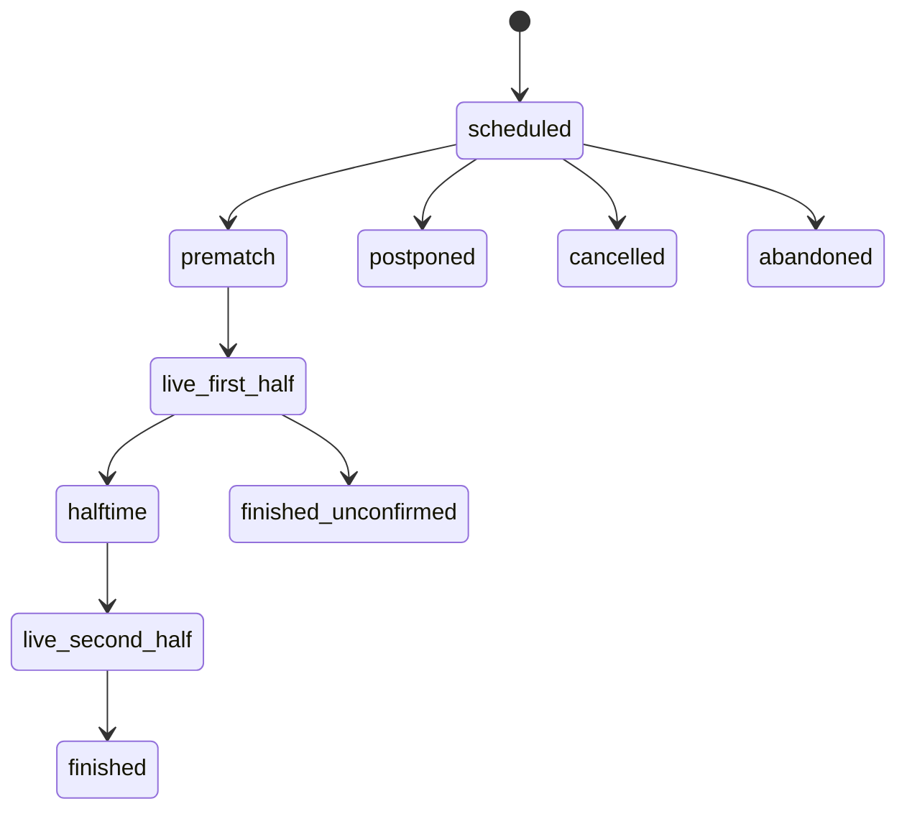

# Match Lifecycle

Lifecycle resolution uses provider status first, then persisted phase, kickoff evidence, and
capture windows. Terminal evidence always wins over time heuristics.

Upcoming requires scheduled or prematch and a kickoff strictly after the request snapshot.
Finished, interrupted, live, unknown-in-progress, and past-kickoff rows are excluded.
Public lifecycle fields include safe source, confidence, reason code, active, and terminal
flags without exposing raw provider payloads.
