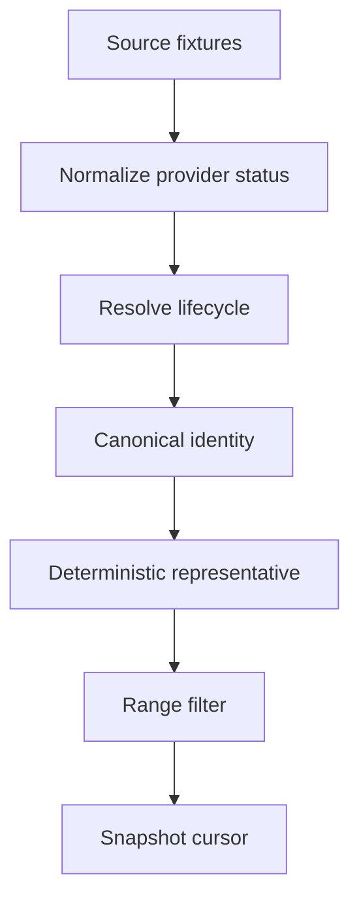

# Matches Catalog Architecture

The catalog is a read model over preserved source fixtures. Provider rows are never deleted
or destructively merged. Public identity uses normalized sport, competition, oriented teams,
stage, and a five-minute kickoff bucket; incomplete identity gets a fixture-specific key.

Representative priority is terminal/live evidence, lifecycle confidence, identity
completeness, valid kickoff, MatchState, events, odds, latest data, update timestamp, then
lexical fixture ID. Conflicting terminal/live evidence remains visible as ambiguity.
The API scans at most 250 rows per DB page, uses a bounded budget, batches enrichment, and
reports `scanned_count`, `snapshot_at`, and `data_status`.
