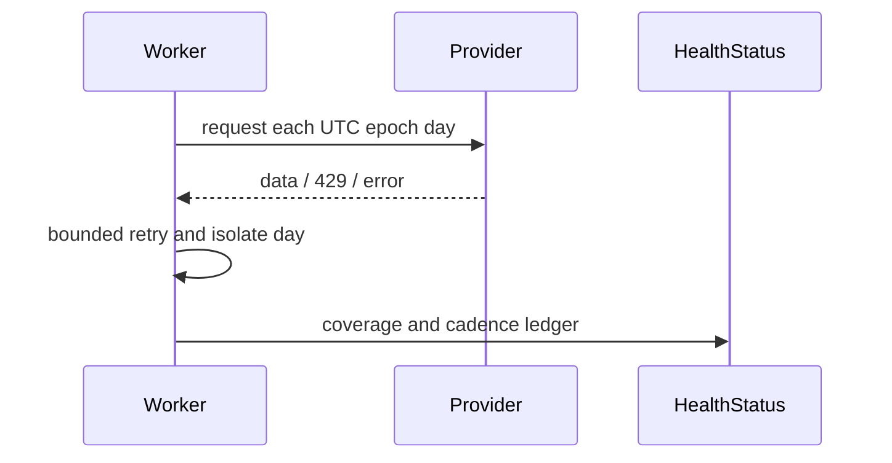

# Fixture Discovery Operations

Each worker discovery cycle requests one UTC backfill day plus fourteen future days by
default. Configure `MATCHPULSE_DISCOVERY_BACKFILL_DAYS`,
`MATCHPULSE_DISCOVERY_FUTURE_DAYS`, `MATCHPULSE_NEAR_DISCOVERY_INTERVAL_MS`,
`MATCHPULSE_FAR_DISCOVERY_INTERVAL_MS`, and `MATCHPULSE_DISCOVERY_RETRIES`.

Days are isolated. Provider failures use bounded exponential backoff, jitter, and
`Retry-After`; the health ledger records requested, attempted, successful, failed, and
rate-limited days, retries, fixture counts, start bounds, horizon, and next cadences.

