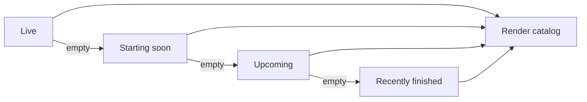

# Matches Experience

Initial selection follows Live now, Starting soon, Upcoming, then Recently finished when
earlier ranges are empty. All is available only through explicit user selection. A manual
tab selection is never overridden by refresh.

Cards use local date/time, countdowns, lifecycle labels, freshness, availability, precise
empty/error messages, cancellation of stale requests, and cursor-based Load more.
